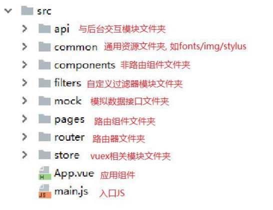
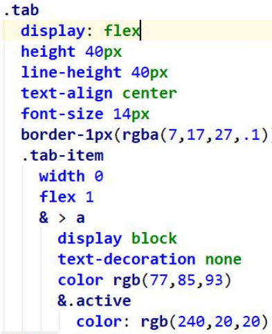
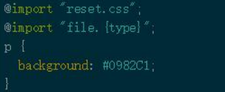

### 一、打包与发布项目

1、开发环境下运行

​	npm run dev（等同于npm start）都是在开发环境下运行项目

​	访问: http://localhost:8080 

​	编码, 自动编译打包(HMR), 查看效果

2、打包发布

​	npm run build 

​	npm install -g serve  **//全局安装serve，用来部署运行我的文件夹（dist）**

​	serve dist 

​	访问: http://localhost:5000 

### 二、资源准备

#### 1、相关概念

1. 图片Base64：样式中引用的小图片，在webpack打包会自动处理转换为样式内部的Base64编码字符串。（限制：文件不能太大，文件太大塞到页面中会半天看不到文字）

   > 作用是把图片转换为字符串，但是显示的时候显示出来的是图片，这样做的好处是：（以空间换时间）减少请求的次数，如果不这样做我要单独发一个请求才能显示图片。如果这么做了，那它就会被保存为文件中的一个字符串。

2. 2x 与 3x 图: 不同手机的屏幕密度不一样, 一般都在 2 以上(如 iphone6 为 2,iphone6s 为3), 为了适配不同的手机, UI 设计师为同一个图片制作了 2x 和 3x 的 2 套图片(图形一样, 但大小不一样)

#### 2、iconfont字体图片

1、iconfont 使用(本地没有 svg)

​	目前国内用的最多的是阿里巴巴矢量库（http://www.iconfont.cn/）

#### 3、项目设计目录

#### 4、安装stylus包

npm install stylus stylus-loader --save-dev

- stylus：将stylus转换为CSS

- stylus-loader：让Webpack去理解CSS

基本语法：

1. 结构化: 完全通过缩进控制, 不需要大括号和分号, 冒号是可选的

   

2. 父级引用 :使用字符&指向父选择器

3. 变量

   1. 定义变量: name=value 如: mainColor = #0982c1 
   2. 引用变量: name 如: color mainColor 
   3. name 可以没有前缀要求, 但最好以$开头(好识别) 

4. 混合(Mixins)

   a. 也就是预处器中的函数 

   b. 函数参数可以指定默认值 

   c. 某段 CSS 样式要用到多个元素上, 只有其中的 1,2 个样式值有变化

5. 导入(import)  ,通过@import 引入其它样式文件

   

6. 

<<<<<<< HEAD
#### 5、Vue-router的理解和使用

​	router-view/router-link/keep-alive

​	$router:路由对象，包含一些操作路由的功能函数，来实现编程式导航（路由跳转）

​	$route：当前路由对象，一些当前路由信息数据的容器，path/meta/query/param

​	项目路由拆分

​	底部导航组件：HeaderTop，通过slot来实现组件通信标签结构

​	商家列表组件：ShopList 

​	
=======

>>>>>>> f2909432374243aebf1090142a13c10999394dd5
