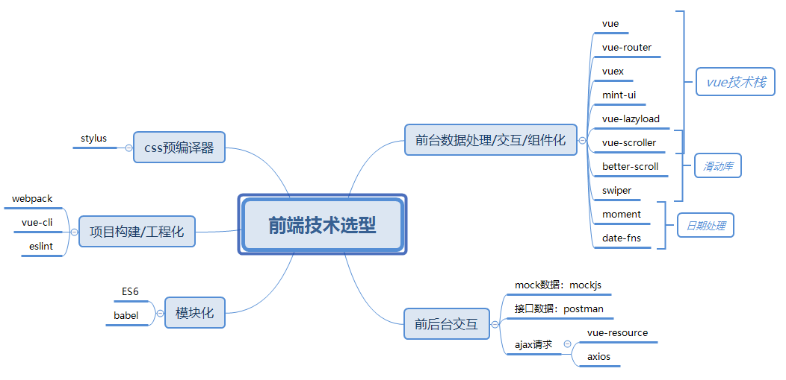
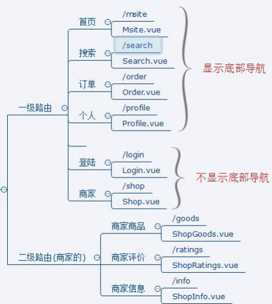

## Vue谷粒外卖系统

### 项目描述

1) 此项目为外卖 Web App (SPA) 

2) 包括商家, 商品, 购物车, 用户等多个子模块 

3) 使用 Vue 技术栈+ES6+Webpack 等前端等热门技术 

4) 采用模块化、组件化、工程化的模式开发

### 项目技术结构

#### 项目路由

### 部署流程

##### 必备软件

- node：>8, [地址](https://nodejs.org/zh-cn/)，最好选择LTS版本
- mongodb
- git

##### 部署流程

1. 启动mongodb数据库
   1. cd /gshop-server/db/
   2. 复制该路径
   3. 执行 mongod --dbpath +你复制的路径；
2. 启动后端服务
   1. cd /gshop-server/
   2. npm start
3. 启动前端项目
   1. cd /gshop-client/
   2. npm start

### 实现效果图

